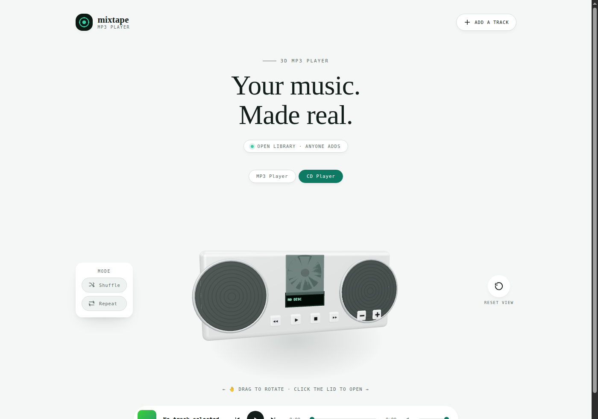

<div align="center">

# 🎵 Mixtape

**Your MP3s, your server, real sound equipment.**
Open, no-login library · Interactive 3D devices · No subscriptions.

[](https://github.com/mateuseap/mixtape/actions)
[](https://github.com/mateuseap/mixtape/actions)
[](https://github.com/mateuseap/mixtape/releases)
[](LICENSE)
[](https://github.com/mateuseap/mixtape/stargazers)
[](https://github.com/mateuseap/mixtape)

<br />



<br />

</div>

---

## Why Mixtape?

Streaming services do not keep your files, and existing self-hosted media servers are built for entire collections with transcoding, users, and settings you do not need for a personal MP3 folder. Mixtape is a small, single-purpose alternative: upload MP3s, then play them back on real interactive 3D sound equipment, all running on your own server.

Mixtape is a growing rack of equipment, not a single fixed player. Switch between devices with the tabs above the stage; every device shares the same open library and playback state.

- **Your files.** MP3s live on your server, not a third party's.
- **Real equipment, not a generic player.** An MP3 click-wheel device and a CD boombox so far, each modeled and interactive on its own terms, with more equipment planned.
- **Open library.** No accounts, no password gate. Anyone with access to the app can add or play tracks.

## Features

|  |  |
|--|--|
| 🎛 **Clickable 3D click wheel** | A draggable, auto-rotating WebGL device with printed icons at every zone: play/pause in the center, volume and skip at top/bottom/left/right, exactly like a real click wheel |
| 💿 **CD player** | A boombox with a hinged lid you open to reveal the loaded disc, transport buttons (play/pause, stop, skip), and its own volume controls |
| 📈 **Live LCD readouts** | The click wheel's screen shows a real oscilloscope-style waveform from the actual audio and a segmented volume meter, not just a track name |
| 📤 **Drop-in uploads** | Pick an MP3 and it appears in the library immediately, no form fields required |
| 🏷 **Automatic tagging** | ID3 title/artist/album/duration parsed on upload, falls back to the filename |
| ⏩ **Real seeking** | HTTP Range-request streaming, so scrubbing does not need the whole file downloaded |
| 🔀 **Shuffle & repeat** | Standard playback modes, no page reload |
| 🌍 **Open by default** | No accounts, no password, anyone with the link can add and play |

## Quick Start

```bash
git clone https://github.com/mateuseap/mixtape && cd mixtape
pnpm install
cp .env.example server/.env
pnpm dev
```

Open `http://localhost:5173`, no login step needed.

## How It Works

A single Node/Express service serves the built client and a small JSON API from one process. Uploaded MP3 files and a SQLite metadata database live on disk (`DATA_DIR`, mounted from a persistent volume in production). ID3 tags are parsed on upload for title, artist, album, and duration, falling back to the filename when tags are missing. Playback uses HTTP Range requests so seeking and scrubbing work without loading the whole file.

## Stack

| Layer | Technology |
|-------|-----------|
| Server | Node 22, Express, better-sqlite3, multer, music-metadata |
| Client | Vite, vanilla JavaScript, no framework, three.js |
| Auth | None, open access library |
| Tests | vitest, supertest |
| Deploy | Docker, GitHub Actions to GHCR |

## Documentation

| Doc | Description |
|-----|------------|
| [Design Spec](https://github.com/mateuseap/homelab/blob/main/docs/specs/2026-07-25-mixtape-design.md) | Architecture decisions and rationale |
| [Deployment Manifests](https://github.com/mateuseap/homelab/tree/main/apps/mixtape) | Kubernetes Deployment, Service, Ingress, PVC |

Mixtape's design docs live in the [homelab](https://github.com/mateuseap/homelab) repo, alongside every other app it deploys, rather than in this repo.

## Contributing

Read [CONTRIBUTING.md](CONTRIBUTING.md) before opening a PR. Branch from `develop`, use Conventional Commits, keep the test suite green, and assign **@mateuseap** for review.

## License

MIT, see [LICENSE](LICENSE).
